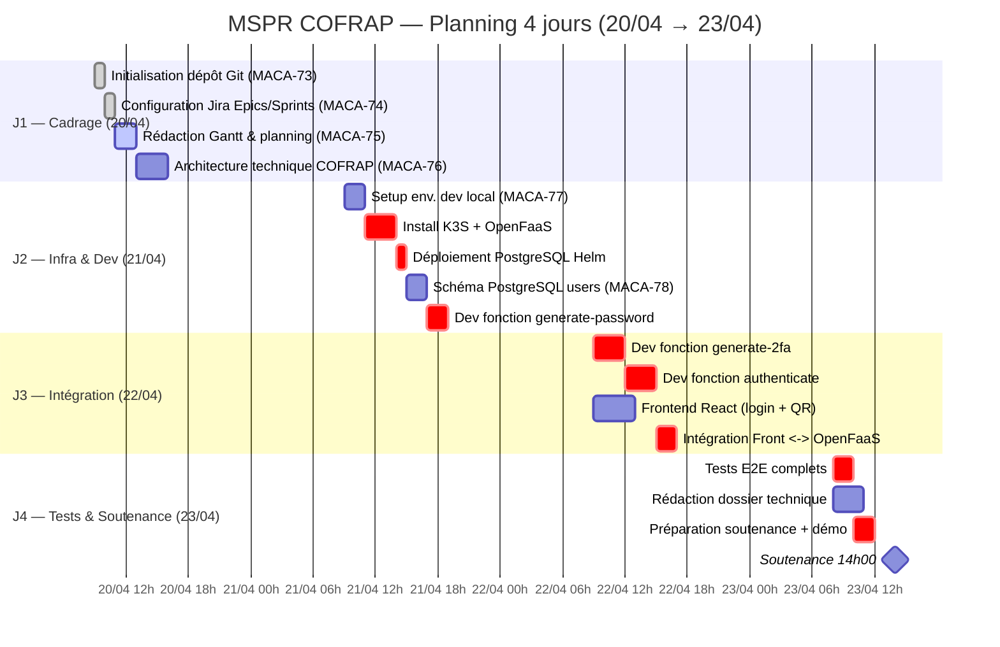

# MACA-75 — Gantt & Planning Projet MSPR COFRAP

> **Epic** : MACA-67 — Gestion de Projet & Organisation
> > **Sprint** : Sprint 1 — J1 Cadrage
> > > **Story Points** : 3
> > > > **Assignee** : Youssef Assoil
> > > > > **Statut** : En cours
> > > > >
> > > > > ---
> > > > > 
## 1. Objectif

Établir le planning complet (diagramme de Gantt) du MSPR COFRAP sur 4 jours (20/04 → 23/04), identifier les dépendances entre tâches et faire ressortir le **chemin critique** menant à la soutenance du J4 à 14h00.

---

## 2. Périmètre & Jours couverts

| Jour | Date       | Thème principal                                  |
|------|------------|--------------------------------------------------|
| J1   | 20/04/2026 | Cadrage, Jira, Git, Architecture                 |
| J2   | 21/04/2026 | Infra K3S, OpenFaaS, Dev des fonctions           |
| J3   | 22/04/2026 | Dev complet, intégration, premiers tests         |
| J4   | 23/04/2026 | Tests finaux, Dossier, **Soutenance 14h00**      |

---

## 3. Diagramme de Gantt (Mermaid)



---

## 4. Tableau récapitulatif des tâches

| ID       | Tâche                                 | Jour | Durée | Dépendances        | Critique |
|----------|---------------------------------------|------|-------|--------------------|----------|
| MACA-73  | Init dépôt Git                        | J1   | 1h    | —                  | Non      |
| MACA-74  | Config Jira                           | J1   | 1h    | MACA-73            | Non      |
| MACA-75  | Gantt & planning                      | J1   | 2h    | MACA-74            | Non      |
| MACA-76  | Architecture technique                | J1   | 3h    | MACA-75            | **Oui**  |
| MACA-77  | Setup env. dev local                  | J2   | 2h    | MACA-76            | **Oui**  |
| —        | Install K3S + OpenFaaS                | J2   | 3h    | MACA-77            | **Oui**  |
| —        | Déploiement PostgreSQL Helm           | J2   | 1h    | K3S                | **Oui**  |
| MACA-78  | Schéma PostgreSQL (users)             | J2   | 2h    | PostgreSQL up      | **Oui**  |
| —        | Fonction `generate-password`          | J2   | 2h    | Schéma DB          | **Oui**  |
| —        | Fonction `generate-2fa` (TOTP+QR)     | J3   | 3h    | generate-password  | **Oui**  |
| —        | Fonction `authenticate`               | J3   | 3h    | generate-2fa       | **Oui**  |
| —        | Frontend React                        | J3   | 4h    | Architecture       | Non      |
| —        | Intégration Front ↔ OpenFaaS          | J3   | 2h    | authenticate + FE  | **Oui**  |
| —        | Tests E2E                             | J4   | 2h    | Intégration        | **Oui**  |
| —        | Dossier technique                     | J4   | 3h    | Toutes les tâches  | Non      |
| —        | Préparation soutenance                | J4   | 2h    | Tests E2E          | **Oui**  |
| 🎯       | **Soutenance**                        | J4   | —     | Tout               | **Oui**  |

---

## 5. Chemin critique

Le chemin critique (séquence des tâches sans marge, dont le retard impacte la soutenance) est :

```
MACA-76 (Archi)
   ↓
MACA-77 (Setup env)
   ↓
Install K3S + OpenFaaS
   ↓
Déploiement PostgreSQL
   ↓
MACA-78 (Schéma DB)
   ↓
generate-password
   ↓
generate-2fa
   ↓
authenticate
   ↓
Intégration Front ↔ OpenFaaS
   ↓
Tests E2E
   ↓
Préparation soutenance
   ↓
🎯 Soutenance J4 14h00
```

**Durée totale du chemin critique** : ~26h sur 4 jours → marge faible, surveillance quotidienne.

---

## 6. Jalons (Milestones)

| Jalon | Date / Heure       | Description                                  |
|-------|--------------------|----------------------------------------------|
| M1    | 20/04 — 18h00      | Cadrage terminé (Git + Jira + Gantt + Archi) |
| M2    | 21/04 — 18h00      | Infra K3S/OpenFaaS up + `generate-password`  |
| M3    | 22/04 — 18h00      | 3 fonctions OpenFaaS opérationnelles + Front |
| M4    | 23/04 — 12h00      | Tests E2E OK + dossier prêt                  |
| 🎯 M5 | **23/04 — 14h00**  | **Soutenance MSPR**                          |

---

## 7. Risques & mitigation

| Risque                              | Probabilité | Impact | Mitigation                                  |
|-------------------------------------|-------------|--------|---------------------------------------------|
| Install K3S échoue                  | Moyenne     | Fort   | Avoir une VM de secours / fallback Docker   |
| Problème réseau OpenFaaS Gateway    | Moyenne     | Fort   | Tester `port-forward` dès J2 matin          |
| QR Code 2FA non scannable           | Faible      | Moyen  | Tester avec Google Authenticator dès J3     |
| Retard sur le Frontend              | Moyenne     | Faible | Frontend en parallèle, non critique         |

---

## 8. Export

- **Format Markdown** : ce fichier (rendu Mermaid auto sur GitHub).
- - **Export PDF/PNG** : utiliser [Mermaid Live Editor](https://mermaid.live/) → coller le bloc Gantt → Export PNG/PDF.
  - - Le PNG exporté sera ajouté dans `docs/planning/gantt.png`.
   
    - ---

    ## 9. Critères d'acceptation (DoD)

    - [x] Gantt couvre les 4 jours (20/04 → 23/04)
    - [ ] - [x] Toutes les tâches clés identifiées et chiffrées
    - [ ] - [x] Chemin critique visible et documenté
    - [ ] - [x] Format exportable PDF/PNG (via Mermaid Live)
    - [ ] - [x] Jalons et risques documentés
   
    - [ ] ---
   
    - [ ] _Document lié à Jira : [MACA-75](https://youssef-assoil.atlassian.net/browse/MACA-75)_
    - [ ] 
